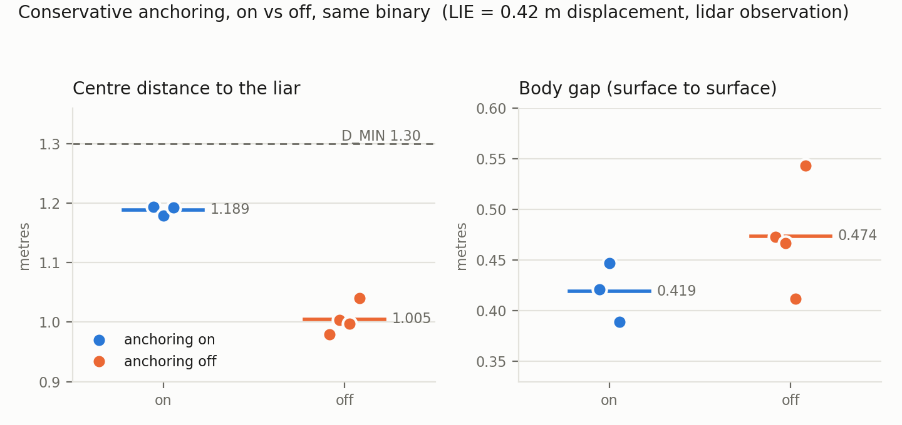

# Conservative anchoring, measured by its absence (2026-08-06)

The headline mechanism is "take the nearer of what a peer claims and what you observe of
it". A liar can only ever place itself further away, and that direction is never believed,
so the lie stops paying without anyone having to detect it. This is the first measurement
of what it is worth, because until today it could not be switched off.

## What was wrong with the old comparison

The mechanism ran unconditionally. `detection_log_only` silences the DETECTOR, not this.
So the 0.038 m body gap that the defended runs were being compared against was measured on
2026-07-30 — a day before anchoring was written (`293cf06`, 2026-07-31). Two numbers from
two builds are not an A/B, and this repository already holds itself to "same binary, flip
one parameter" elsewhere (see the corpse-anchor K_SEND work).

`enable_conservative_anchor:=false` now zeroes the peer offset. Everything else in the loop
still runs — the observation is still taken, the keep-out still placed, the belief layer
still fed — so the arm isolates this mechanism rather than "perception off".

## Setup

| | |
|---|---|
| Attack | `LIE=-0.30` on x and y, i.e. 0.424 m of claimed displacement, held for the run |
| `LIE_DEAF` | **0** — see below |
| Observation | `lidar` (each dog's own point cloud; no ground truth in the safety path) |
| Fleet | 3x vision60 with lidar, V formation, `d_run.sh 2` |
| Runs | 3 with anchoring on, 4 with it off, interleaved, one at a time on an idle machine |

`LIE_DEAF=0` matters. With the default the attacker also goes deaf, times out its peers,
and broadcasts a roster without them; the survivors' EXIT rule then blocks it in about half
a second **in both arms**, for a reason that has nothing to do with the mechanism under
test. The cost of turning it off is that the liar still runs its own collision avoidance,
so some of the separation that survives is its doing — that bias understates the damage,
which is the safe direction for a claim that anchoring helps.

## Result

| | anchoring on | anchoring off |
|---|---|---|
| Centre distance to the liar | 1.180, 1.194, 1.180 | 0.979, 0.997, 1.004, 1.041 |
| mean | **1.189** | **1.005** |
| within-arm spread | 0.014 | 0.062 |
| Body gap (worst pair) | 0.389, 0.421, 0.447 | 0.412, 0.467, 0.473, 0.543 |
| mean | 0.419 | 0.474 |

**Centre distance separates completely** — the lowest anchored run (1.180) is above the
highest unanchored one (1.041), and the anchored arm varies by 14 mm across three runs. The
lie displaces the claimed position by 0.424 m; anchoring recovers **0.184 m** of it.

**Body gap does not separate at all**, and that is not noise either — both arms are
consistent across their runs, and the unanchored arm reads slightly *higher*. Relative
heading dominates that number: at 1.18 m centre distance the measured 0.95 x 0.55 m
silhouette gives 0.63 m of clearance broadside and 0.23 m nose-to-nose, a 0.4 m swing
against the 0.18 m the mechanism buys.

## What to report, and what not to

Report **centre distance** for this mechanism, and say why: it is the quantity the barrier
is built from, so it is what the correction acts on directly.

Body gap remains the honest measure of whether anything touched — a centre distance can
read 0.68 m too optimistic, which is why this project stopped using it for contact. It is
simply too coarse an instrument for a 0.18 m effect that competes with a 0.4 m orientation
term. Publishing both, with that explanation, is better than quoting whichever one flatters
the mechanism.

## A finding worth more than the switch

**The standard lie direction is the harmless one.** `dds_transport.hpp` adds `+off` to both
x and y, and the compromised robot's slot is at (-0.404, -0.7), so a positive `LIE` moves
its claimed position *toward* both survivors. Anchoring only ever believes the nearer
reading, so it correctly does nothing, and the fleet gives the phantom more room than it
needs — safe, and invisible to an A/B.

The first pair here was run that way and the two arms were identical (0.498 vs 0.555 body
gap, centre 1.27 vs 1.28), which is the correct behaviour, not a null result. Every number
above uses `LIE=-0.30`.

Any earlier experiment using a positive `LIE` was, on this geometry, attacking in the
direction the defence is designed to ignore.

## Files

    logs/ab_on.log, ab_off.log        the first pair, positive LIE (the harmless direction)
    logs/rep_*_true.log, *_false.log  the repeats, LIE=-0.30
    logs/d_*_phys_gap.csv             the 20 Hz surface-to-surface series each gap came from
    plot_ab.py                        regenerates the figure from the numbers above

One repeat (`rep_2_true`) is absent: its harness refused the run because the detector had
flagged the victim twice *before* the attack was armed, so nothing after that point was
attributable. The machine was at load 10 at the time. That is the guard working.
